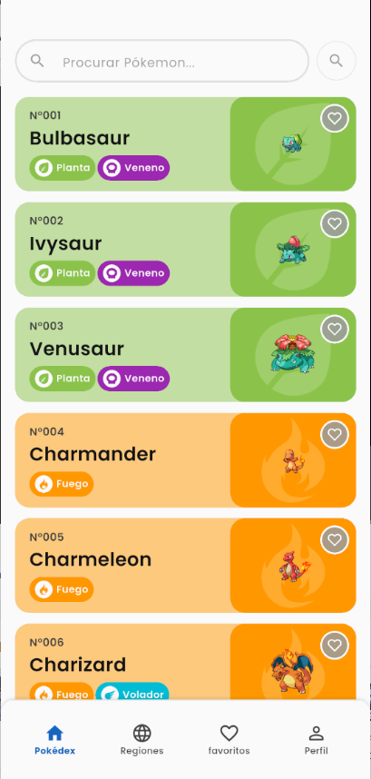
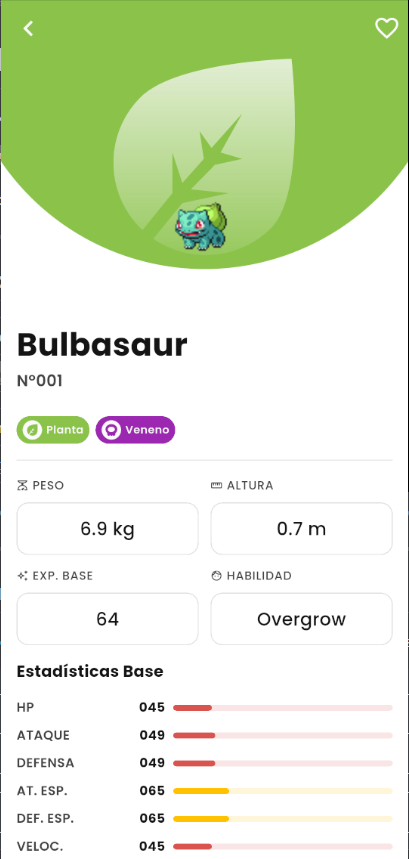
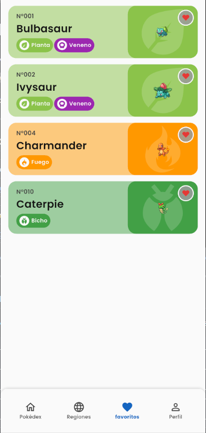
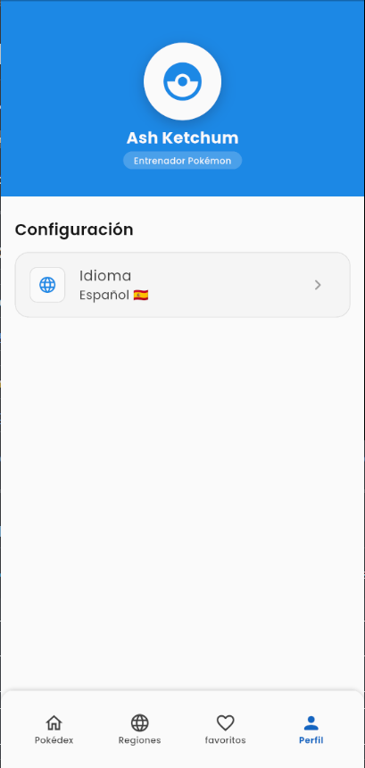

# 🔴 Pokémon Favorites

**Pokédex con gestión de favoritos**

[](https://flutter.dev)
[](https://dart.dev)
[](https://app.codecov.io/gh/Hanuar99/pokemon_favorites/tree/master)
[](https://blog.cleancoder.com/uncle-bob/2012/08/13/the-clean-architecture.html)

Aplicación Flutter que consume la [PokéAPI](https://pokeapi.co/) y permite al usuario guardar sus Pokémon favoritos localmente.

---

## 📸 Screenshots

| Pokédex | Detalle |
|:---:|:---:|
|  |  |

| Favoritos | Perfil |
|:---:|:---:|
|  |  |


---

## 🏗️ Architecture

El proyecto aplica **Clean Architecture** con tres capas bien definidas y gestión de estado reactiva mediante **Riverpod**.

> Regla de dependencia: las capas externas dependen de las internas. `domain/` es Dart puro — cero imports de Flutter, Dio o Riverpod.

```
╔══════════════════════════════════════════════════════════════════════╗
║                      PRESENTATION LAYER                              ║
║                                                                      ║
║  ┌─────────────────┐   ref.watch   ┌──────────────────────────────┐  ║
║  │  Screen/Widget  │◀─────────────▶│  Provider (@riverpod)       │  ║
║  │  ConsumerWidget │               │  AsyncNotifier / fn          │  ║
║  └─────────────────┘               └──────────────────────────────┘  ║
╠══════════════════════════════════════════════════════════════════════╣
║                       DOMAIN LAYER  (Dart puro)          ▲           ║
║                                                  depends on domain   ║
║  ┌─────────────────┐    calls      ┌──────────────────────────────┐  ║
║  │  Entity         │◀───────────── │  UseCase                     │  ║
║  │  @freezed       │               │  UseCase<T, Params>          │  ║
║  └─────────────────┘               └───────────────┬──────────────┘  ║
║                                                    │ abstract call   ║
║                                    ┌───────────────▼──────────────┐  ║
║                                    │  Repository (abstract)       │  ║
║                                    └──────────────────────────────┘  ║
╠══════════════════════════════════════════════════════════════════════╣
║                        DATA LAYER                        ▲           ║
║                                               implements domain      ║
║  ┌─────────────────┐               ┌──────────────────────────────┐  ║
║  │  Model          │◀──────────────│  RepositoryImpl              │  ║
║  │  @freezed+JSON  │               └──────────┬───────────────────┘  ║
║  └─────────────────┘                          │                      ║
║                                  ┌────────────┴─────────────┐        ║
║                          ┌───────▼──────┐         ┌─────────▼────┐   ║
║                          │   Remote     │         │    Local     │   ║
║                          │  Datasource  │         │  Datasource  │   ║
║                          │  (Dio/HTTP)  │         │ (SharedPrefs)│   ║
║                          └──────────────┘         └──────────────┘   ║
╚══════════════════════════════════════════════════════════════════════╝
```

### Flujo de una acción de usuario

```
 ┌─────────────────────────────────────────────────────────────────────────┐
 │  1. USER ACTION  (tap favorito, scroll, búsqueda)                       │
 └────────────────────────────────┬────────────────────────────────────────┘
                                  │
                                  ▼
 ┌────────────────────────────────────────────────────────────────────────┐
 │  2. WIDGET  →  llama al provider vía ref.read(provider.notifier)       │
 └────────────────────────────────┬───────────────────────────────────────┘
                                  │
                                  ▼
 ┌────────────────────────────────────────────────────────────────────────┐
 │  3. PROVIDER  (Riverpod AsyncNotifier)  →  invoca el UseCase           │
 └────────────────────────────────┬───────────────────────────────────────┘
                                  │
                                  ▼
 ┌────────────────────────────────────────────────────────────────────────┐
 │  4. USE CASE  →  orquesta la lógica de negocio                         │
 │                  llama repository.method(params)                       │
 └────────────────────────────────┬───────────────────────────────────────┘
                                  │
                                  ▼
 ┌────────────────────────────────────────────────────────────────────────┐
 │  5. REPOSITORY IMPL  →  decide fuente de datos                         │
 │                                                                         │
 │            ┌────────────────────────────────┐                          │
 │            │                                │                          │
 │            ▼                                ▼                          │
 │   ┌─────────────────┐             ┌──────────────────┐                 │
 │   │  RemoteDatasrc  │             │  LocalDatasrc    │                 │
 │   │  Dio → PokéAPI  │             │  SharedPrefs     │                 │
 │   └────────┬────────┘             └────────┬─────────┘                 │
 │            │                               │                           │
 └────────────┼───────────────────────────────┼───────────────────────────┘
              │                               │
              ▼                               ▼
 ┌────────────────────────────────────────────────────────────────────────┐
 │  6. Either<Failure, Entity>                                             │
 │                                                                         │
 │   Left(ServerFailure)  ──────────────▶  error controlado en la UI      │
 │   Right(PokemonEntity) ──────────────▶  datos hacia el Provider        │
 └────────────────────────────────┬───────────────────────────────────────┘
                                  │
                                  ▼
 ┌────────────────────────────────────────────────────────────────────────┐
 │  7. PROVIDER  →  emite nuevo estado                                     │
 │                  AsyncData(entity)  /  AsyncError(failure)             │
 └────────────────────────────────┬───────────────────────────────────────┘
                                  │
                                  ▼
 ┌────────────────────────────────────────────────────────────────────────┐
 │  8. WIDGET rebuild  →  UI actualizada reactivamente                    │
 └────────────────────────────────────────────────────────────────────────┘
```

---

## 🛠️ Tech Stack

| Package | Versión | Propósito |
|---|---|---|
| `flutter_riverpod` | ^3.0.0 | Gestión de estado reactiva |
| `riverpod_annotation` | ^4.0.0 | Anotaciones para generación de providers |
| `freezed_annotation` | ^3.0.0 | Data classes inmutables, unions |
| `json_annotation` | ^4.11.0 | Anotaciones para serialización JSON |
| `dartz` | ^0.10.1 | Programación funcional (`Either`, `Unit`) |
| `dio` | ^5.4.0 | Cliente HTTP con interceptores |
| `go_router` | ^17.0.0 | Navegación declarativa con deep linking |
| `cached_network_image` | ^3.3.1 | Caché de imágenes con placeholder |
| `shimmer` | ^3.0.0 | Skeleton loading animado |
| `shared_preferences` | ^2.2.2 | Persistencia local clave-valor |
| `flutter_svg` | ^2.0.10 | Renderizado de iconos SVG |
| `google_fonts` | ^8.0.0 | Tipografía Google Fonts |
| `equatable` | ^2.0.5 | Value equality en Params y NoParams |
| `intl` | ^0.20.2 | Soporte de internacionalización |
| `build_runner` | ^2.12.0 | Pipeline de generación de código |
| `riverpod_generator` | ^4.0.0 | Generación de providers desde anotaciones |
| `freezed` | ^3.0.0 | Generación de data classes inmutables |
| `json_serializable` | ^6.9.0 | Generación de serialización JSON |
| `flutter_gen_runner` | ^5.13.0 | Assets type-safe generados |
| `mocktail` | ^1.0.3 | Mocking para tests unitarios |

---

## 🚀 Getting Started

### Prerrequisitos

| Herramienta | Versión mínima |
|---|---|
| Flutter SDK | 3.x (stable channel) |
| Dart SDK | ^3.11.0 |


### Instalación

```bash
# 1. Clonar el repositorio
git clone https://github.com/Hanuar99/pokemon_favorites
cd pokemon_favorites

# 2. Instalar dependencias
flutter pub get

# 3. Generar código (freezed, json_serializable, riverpod_generator, flutter_gen)
dart run build_runner build --delete-conflicting-outputs

# 4. Ejecutar en modo debug
flutter run

# 5. Build release Android
flutter build apk --release
```

> ⚠️ El paso 3 es **obligatorio**. Sin él, los archivos `.g.dart` y `.freezed.dart` no existen y el proyecto no compila.

---

## 🧪 Testing

### Ejecutar tests

```bash
# Todos los tests
flutter test
```


### Suite de tests

| Capa | Archivos de test |
|---|---|
| Domain — entities | `pokemon_entity_test`, `pokemon_detail_entity_test` |
| Domain — use cases | `get_pokemon_list_test`, `get_pokemon_detail_test`, `toggle_favorite_test`, `get_favorites_test` |
| Data — models | `pokemon_list_response_model_test`, `pokemon_detail_model_test`, `pokemon_favorite_model_test` |
| Data — datasources | `pokemon_remote_datasource_test`, `pokemon_local_datasource_test` |
| Data — repository | `pokemon_repository_impl_test` |
| Core | `api_constants_test`, `exceptions_test`, `failures_test`, `locale_repository_impl_test` |
| Core — use cases | `get_locale_usecase_test`, `set_locale_usecase_test` |

### Convenciones de test

```dart
// Patrón AAA + nombre descriptivo
test('should return Right(locale) when SharedPreferences has a value', () async {
  // Arrange
  when(() => mockPrefs.getString(localeKey)).thenReturn('es');
  // Act
  final result = await usecase(NoParams());
  // Assert
  expect(result, Right('es'));
  verifyNoMoreInteractions(mockPrefs);
});
```

---

## ⚙️ CI / CD

El proyecto incluye un pipeline de GitHub Actions (`.github/workflows/ci.yml`) que se dispara automáticamente en cada `push` o `pull_request` a `main`, `master` o `develop`.

### Pasos del pipeline

| # | Paso | Detalle |
|---|---|---|
| 1 | **Checkout** | Clona el repositorio en `ubuntu-latest` |
| 2 | **Setup Flutter** | Instala Flutter 3.x stable (con caché) |
| 3 | **Install dependencies** | `flutter pub get` |
| 4 | **Generate code** | `build_runner build` — regenera `*.g.dart` y `*.freezed.dart` |
| 5 | **Run tests** | `flutter test --coverage` — ejecuta toda la suite |
| 6 | **Filter coverage** | `lcov` excluye archivos generados (`*.g.dart`, `*.freezed.dart`) |
| 7 | **Upload to Codecov** | Sube `lcov_clean.info` a Codecov (requiere secret `CODECOV_TOKEN`) |
| 8 | **Generate HTML report** | `genhtml` genera reporte visual de cobertura |
| 9 | **Upload artifact** | Sube el reporte HTML como artefacto descargable |

### Ver el reporte de cobertura

**Opción 1 — Online (recomendado):** el badge de Coverage en la cabecera de este README apunta directamente al reporte interactivo en Codecov:

```
https://app.codecov.io/gh/Hanuar99/pokemon_favorites/tree/master
```

Desde ahí se puede navegar archivo por archivo y ver qué líneas están cubiertas o no.

**Opción 2 — Artifact descargable:** cada ejecución del pipeline genera un reporte HTML local disponible durante 30 días:

```
GitHub → Actions → [ejecución] → Artifacts → coverage-report → descargar ZIP → abrir index.html
```


---

## 🔒 Security Layers

| Capa | Implementación | Beneficio |
|---|---|---|
| **Either pattern** | `dartz` → `Either<Failure, T>` | Manejo de errores sin excepciones no controladas |
| **Freezed type-safety** | Data classes inmutables con unions | Previene estados imposibles y mutaciones accidentales |
| **Constantes centralizadas** | `ApiConstants`, `AppColors`, `AppDimensions` | Un solo lugar de verdad, sin magic numbers/strings |
| **Failures tipados** | `CacheFailure`, `ServerFailure` | Errores semánticos que la UI maneja con granularidad |
| **Sin dynamic** | Tipado explícito en todo el codebase | Errores detectados en compile-time, no en runtime |
| **Separación de capas** | Repository abstracto en domain | Data layer reemplazable sin afectar lógica de negocio |
| **Obfuscation ready** | Flag `DART_OBFUSCATION` disponible | Release builds pueden ofuscar el código Dart |

---

## 🤖 AI Usage — GitHub Copilot

### Herramienta utilizada
**GitHub Copilot** (integrado en VS Code) como asistente de desarrollo durante toda la prueba.

### ¿Qué generó Copilot?
- Boilerplate inicial de modelos Freezed y configuración de `json_serializable`
- Esqueletos de tests unitarios (estructura AAA: Arrange, Act, Assert)
- Sugerencias de autocompletado en widgets repetitivos (cards, chips, stat bars)
- Traducciones de strings para archivos ARB (i18n)

### Mis reglas personales con Copilot
1. **Nunca aceptar código sin entenderlo** — cada sugerencia fue revisada y comprendida línea a línea
2. **Copilot no diseña arquitectura** — Clean Architecture, estructura de carpetas y decisiones de patrones fueron 100% manuales
3. **Tests como validación** — si Copilot sugería lógica, los tests verificaban su corrección
5. **Sin `dynamic`, sin `print()`** — se rechazaron todas las sugerencias que violaban las reglas del proyecto

### ¿Qué fue 100% manual?
- Arquitectura y estructura de carpetas del proyecto
- Decisiones de diseño: Either pattern, Riverpod, GoRouter, design system
- Flujo de navegación completo y UX
- Lógica de negocio en UseCases y contratos de Repository
- Revisión, corrección y adaptación de todo código sugerido

---

## 🌍 i18n — Internacionalización

La app soporta **Español (ES)** e **Inglés (EN)** con cambio dinámico desde la pantalla de perfil, persistido en `SharedPreferences`.

### Estructura

```
lib/core/l10n/
├── app_localizations.dart          # Generado automáticamente (delegate)
├── app_localizations_es.dart       # Strings en español
├── app_localizations_en.dart       # Strings en inglés
├── l10n_extension.dart             # Extension: context.l10n
├── pokemon_type_l10n.dart          # Traducción de tipos de Pokémon
└── pokemon_stat_l10n.dart          # Traducción de estadísticas
```

### Cómo agregar un nuevo idioma

1. Crear el archivo ARB en `lib/l10n/`:
   ```
   lib/l10n/app_pt.arb    ← ejemplo: portugués
   ```
2. Agregar todas las claves (copiar `app_es.arb` como base y traducir)
3. Regenerar las clases de localización:
   ```bash
   flutter gen-l10n
   ```
4. Agregar el `Locale` en la configuración de `MaterialApp`
5. Traducir tipos Pokémon en `pokemon_type_l10n.dart` y stats en `pokemon_stat_l10n.dart`

### Uso en código

```dart
// Textos de la app
Text(context.l10n.tabPokedex)
Text(context.l10n.noFavoritesTitle)

// Tipos y stats traducidos
translatePokemonType(context.l10n, 'fire')   // "Fuego" / "Fire"
translateStatName(context.l10n, 'hp')        // "PS" / "HP"
```

---

## 📁 Project Structure

```
lib/
├── core/                             # Código compartido entre features
│   ├── constants/
│   │   └── api_constants.dart        # Base URL, endpoints de PokéAPI
│   ├── errors/
│   │   ├── exceptions.dart           # Excepciones de data layer
│   │   └── failures.dart             # Failures de domain (ServerFailure, CacheFailure)
│   ├── gen/
│   │   └── assets.gen.dart           # Assets type-safe (flutter_gen — generado)
│   ├── l10n/                         # Internacionalización ES/EN
│   │   ├── app_localizations.dart    # Generado por flutter gen-l10n
│   │   ├── l10n_extension.dart       # Extension: context.l10n
│   │   ├── pokemon_type_l10n.dart    # Traducción de tipos de Pokémon
│   │   └── pokemon_stat_l10n.dart    # Traducción de estadísticas
│   ├── locale/                       # Feature de persistencia de idioma
│   │   ├── data/
│   │   │   └── locale_repository_impl.dart
│   │   └── domain/
│   │       ├── locale_repository.dart       # Contrato abstracto
│   │       ├── get_locale_usecase.dart
│   │       └── set_locale_usecase.dart
│   ├── providers/
│   │   └── locale_provider.dart      # Provider global de idioma (Riverpod)
│   ├── theme/                        # Design system centralizado
│   │   ├── app_colors.dart           # Todos los colores de la app
│   │   ├── app_border_radius.dart    # Border radii estándar
│   │   ├── app_dimensions.dart       # Dimensiones (icon sizes, card heights...)
│   │   ├── app_spacing.dart          # Espaciados (4, 8, 12, 16, 24, 32...)
│   │   └── app_text_styles.dart      # Estilos de texto con Google Fonts
│   ├── usecases/
│   │   └── usecase.dart              # UseCase<T, Params> + NoParams (equatable)
│   ├── utils/
│   │   ├── pokemon_type_colors.dart  # Colores por tipo de Pokémon
│   │   ├── string_extensions.dart    # Extensions de String
│   │   └── type_icon_resolver.dart   # SVG icons por tipo
│   └── widgets/                      # Widgets reutilizables globales
│       ├── app_loading_widget.dart
│       └── app_primary_button.dart
│
├── features/
│   └── pokemon/
│       ├── data/
│       │   ├── datasources/
│       │   │   └── pokemon_remote_datasource.dart    # Dio → PokéAPI
│       │   ├── models/                               # Freezed + json_serializable
│       │   │   ├── pokemon_detail_model.dart
│       │   │   └── pokemon_list_response_model.dart
│       │   └── repositories/
│       │       └── pokemon_repository_impl.dart      # Implementación concreta
│       ├── domain/                                   # Dart puro — sin Flutter/Dio
│       │   ├── entities/
│       │   │   ├── pokemon_entity.dart               # Entidad lista
│       │   │   └── pokemon_detail_entity.dart        # Entidad detalle
│       │   ├── repositories/
│       │   │   └── pokemon_repository.dart           # Contrato abstracto
│       │   └── usecases/                             # Un archivo por caso de uso
│       └── presentation/
│           ├── providers/                            # @riverpod — generados
│           │   ├── pokemon_list_provider.dart        # Paginación + estado
│           │   ├── pokemon_detail_provider.dart
│           │   ├── pokemon_search_provider.dart      # Búsqueda en tiempo real
│           │   ├── pokemon_type_filter_provider.dart # Filtro por tipo
│           │   └── favorites_provider.dart           # Toggle + persistencia
│           ├── screens/
│           │   ├── main_shell_screen.dart            # Shell con BottomNavBar
│           │   ├── pokemon_list_screen.dart          # Pokédex + búsqueda + filtro
│           │   ├── pokemon_detail_screen.dart        # Stats animados + Hero
│           │   ├── favorites_screen.dart             # Lista + Dismissible
│           │   ├── profile_screen.dart               # Perfil + cambio de idioma
│           │   ├── coming_soon_screen.dart           # Placeholder tab
│           │   └── filter_bottom_sheet.dart          # Filtro por tipo con chips
│           └── widgets/
│               ├── pokemon_card.dart                 # Card con Hero animation
│               ├── pokemon_type_chip.dart            # Chip con icono SVG
│               ├── favorite_button.dart              # Toggle con animación
│               ├── stat_bar_widget.dart              # Barra animada de stat
│               ├── skeleton_pokemon_card.dart        # Shimmer skeleton loading
│               └── empty_state_widget.dart           # Estados vacíos
│
├── app.dart                                          # MaterialApp + theme + l10n
├── main.dart                                         # Entry point
├── router.dart                                       # GoRouter declarativo
└── router.g.dart                                     # Generado por build_runner
```

---

## 🧠 Technical Decisions

### 1. Riverpod
**Decisión**: `flutter_riverpod` + `riverpod_generator` con anotaciones `@riverpod`.  

### 2. Either pattern para manejo de errores
**Decisión**: `dartz` → `Either<Failure, T>` en toda la cadena domain→presentation.  
**Razón**: Evita errores no controlados. El tipo de retorno **fuerza** al llamador a manejar ambos caminos: `Left(Failure)` y `Right(T)`. Sin excepciones silenciosas.

### 3. Freezed para modelos y entidades
**Decisión**: `@freezed` tanto en `data/models/` como en `domain/entities/`.  
**Razón**: Inmutabilidad garantizada en compile-time, `copyWith` generado, `==` y `hashCode` automáticos, y uniones selladas para modelar estados imposibles.  
**Trade-off aceptado**: Requiere `build_runner`, pero el beneficio en seguridad tipada lo justifica ampliamente.

### 4. GoRouter para navegación
**Decisión**: Navegación declarativa con `go_router` y `ShellRoute` para el BottomNavigationBar.  
**Razón**: Deep linking automático, `extra` tipado para pasar entidades entre rutas, integración limpia con Riverpod.  
**Ejemplo**: `context.push('/home/detail/${pokemon.name}', extra: pokemon as PokemonEntity)`.

### 5. Design system como módulo propio
**Decisión**: `AppColors`, `AppSpacing`, `AppDimensions`, `AppTextStyles`, `AppBorderRadius` como clases estáticas en `core/theme/`.  
**Razón**: Un único source of truth. Cualquier cambio visual global se aplica en un solo archivo. Refuerza consistencia y elimina magic numbers/colors en widgets.

### 6. Internacionalización nativa (ARB + flutter gen-l10n)
**Decisión**: Soporte oficial de Flutter con archivos `.arb` + extensión `context.l10n`.  
**Razón**: Generación automática de clases tipadas, sin dependencia de paquetes externos, idioma persistido con `SharedPreferences` + Clean Architecture completa para `locale`.

### 7. Hero animations en cards → detalle
**Decisión**: `Hero` widget con tag dinámico basado en el nombre del Pokémon.  
**Razón**: Transición fluida que conecta visualmente la lista con el detalle. Mejora percibida de rendimiento sin coste real.

### 8. Swipe-to-delete con Dismissible en favoritos
**Decisión**: `Dismissible` con dirección `endToStart` y fondo rojo con icono.  
**Razón**: Patrón UX estándar de eliminación en listas móviles. Familiar e intuitivo para el usuario.

### 9. Infinite scroll con ScrollController
**Decisión**: Detectar threshold al 90% del scroll máximo para cargar la siguiente página.  
**Razón**: Carga progresiva sin necesidad de botón "Ver más". El usuario nunca espera a una paginación explícita.

### 10. locale como feature dentro de core
**Decisión**: `core/locale/` con su propio `Repository`, `UseCase` y `Provider`.  
**Razón**: El idioma afecta toda la app (no es exclusivo de un feature). Aún así, aplica Clean Architecture completa para mantener consistencia arquitectónica y facilitar tests unitarios aislados.

### 11. N+1 calls para enriquecer el listado de Pokémon
**Problema**: El endpoint de listado `GET /api/v2/pokemon?limit=&offset=` solo devuelve `name` y `url` de cada Pokémon — sin imagen, sin tipos, sin ningún dato visual.  
**Decisión**: Por cada Pokémon de la página se lanza en paralelo una llamada al endpoint de detalle usando `Future.wait(...)`, cuyo resultado se usa para construir el `PokemonModel` con imagen y tipos.

```dart
// PokemonRemoteDatasourceImpl — getPokemonList
final details = await Future.wait(
  listResponse.results.map((item) => getPokemonDetail(item.name)),
);
```

**Trade-off aceptado**: `Future.wait` lanza todas las llamadas en paralelo, minimizando la latencia total. El coste es `n` requests por página (20 por defecto), justificado porque la API no ofrece un endpoint alternativo que devuelva esos datos en bloque.

### 12. Adaptación del detalle por limitaciones de la PokéAPI
**Problema**: El endpoint `GET /api/v2/pokemon/{name}` no expone campos como descripción, categoría, debilidades ni género — esos datos están en endpoints separados (`/pokemon-species/`, `/type/`) que requerirían llamadas adicionales por cada Pokémon.  
**Decisión**: Se adaptó la pantalla de detalle para mostrar los datos disponibles directamente en el endpoint:

| Campo del diseño original | Reemplazo adoptado | Endpoint fuente |
|---|---|---|
| Categoría (ej. "Semilla") | Experiencia base (`base_experience`) | `/pokemon/{name}` |
| Descripción Pokédex | — (no incluida) | `/pokemon-species/{name}` requeriría call extra |
| Debilidades por tipo | — (no incluida) | `/type/{name}` requeriría call por cada tipo |
| Género | — (no incluido) | `/pokemon-species/{name}` requeriría call extra |
| Stats (HP, ATK, DEF...) | ✅ Incluidos con barras animadas | `/pokemon/{name}` |
| Habilidades | ✅ Incluidas (no ocultas) | `/pokemon/{name}` |

**Razón**: La prueba especifica explícitamente solo dos endpoints. Agregar más llamadas por pantalla de detalle incrementaría la complejidad de la arquitectura y los tiempos de carga sin ser un requisito evaluado. Las estadísticas y habilidades son una alternativa más rica visualmente que los campos omitidos.

---
